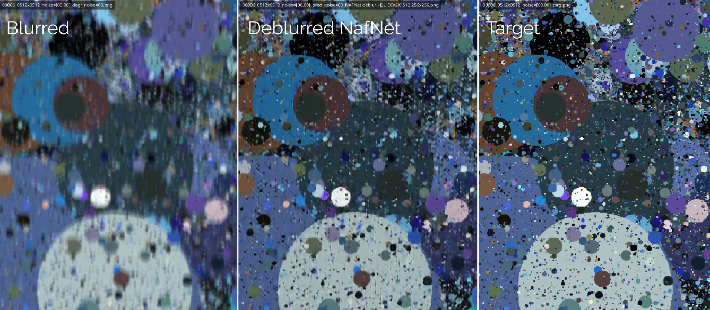

# Blind deblurring from synthetic data
MVA project 2024 on [image restoration](https://delires.wp.imt.fr/)

- Jamy Lafenetre
- Balthazar Neveu

------

In the paper [Synthetic images as a regularity prior for image
restoration neural networks](https://hal.science/hal-03186499/file/papier_SSVM%20%281%29.pdf) by 
*Raphaël Achddou, Yann Gousseau, Saïd Ladjal*, it was shown that a deep neural network can be trained for denoising solely from synthetic dead leave images and does perform relatively well on natural images. 

We propose to explore several tracks:
- Use a [NAFNET](https://github.com/megvii-research/NAFNet) architecture
- Extend deadleaves with extra primitives (lines, diamond shapes, colored gradients)
- Try to see if the generalization property to natural images observed in denoising holds for deblurring. 





We first validated that NAFNet trained on deadleaves performed well on the blind denoising task. Below you can see that it also performs correctly on natural images, although the performances are not as good as a network purely trained on natural images.

| Qualitative results at SNR in = 20dB | Quantitative results
| :---: | :---: |
|  | 


Finally, when applying the deadleaves training to the blind deblurring problem, one of the advantage we have notticed is that the network always tries to deblur even when the level of blur is high. On the contrary, when trained on natural images, the NAFNEt does not work so well when the blur level is too big.
|Blind deblurring results|
|:----:|
|  |
|Deblurring result for different amount of blur, using Nafnet trained on Div2K or deadleaves. From left to right column: ”small”, ”mild” and ”big” blur kernels to degrade the input. **Top row**: input image. **Middle row**: output of NafNet trained on deadleaves.  **Bottom row**: output of NafNet trained on Div2K.|
| |

**Conclusion** : 
- Using extra primitives to pure deadleaves seems like a good idea but did not bring as much as we'd expected. A rework by adding anisotropy and extra geometric shapes could lead to significantly better results.
- Training on deadleaves images brings a lot of stability in trainings (as the image distribution is basically always the same, providing a fair amount of learning signal) and can be seen as a good pretext task before to the real dataset.


------
## Setup

```bash
git clone https://github.com/balthazarneveu/blind-deblurring-from-synthetic-data.git
cd blind-deblurring-from-synthetic-data
pip install -e .
pip install interactive-pipe
pip install batch-processing
```


-------

## Training


##### Supported tasks
- Additive White Gaussian Noise denoising
- Basic anisotropic Gaussian deblur
- Blind motion deblur

##### Supported network architectures
- Stacked convolutions baseline
- NAFNet 

##### Supported dataset
- Images read from disk
- Endless Live generation of deadleaves using a cuda based numba kernel.


##### Synthetic data generation

Generate deadleaves:  `python scripts/save_deadleaves.py -n  deadleaves_primitives_div2k_512`


#### Local training
- Quick debugging / Local `python scripts/train.py -e -1 -nowb`
- Local training. Define experiments in [experiments_definition.py](src/rstor/learning/experiments_definition.py)
```bash
python scripts/train.py -e 1000
```

##### Download image test datasets hosted on Kaggle


- [Presaved deadleave dataset](https://www.kaggle.com/datasets/balthazarneveu/deadleaves-div2k-512)
- [Presaved deadleaves + extra primitives dataset](https://www.kaggle.com/datasets/balthazarneveu/deadleaves-primitives-div2k-512)  
- [Motion blur](https://www.kaggle.com/datasets/balthazarneveu/motion-blur-kernels)

[Kodak](https://www.kaggle.com/datasets/sherylmehta/kodak-dataset/data) | [Gopro](https://www.kaggle.com/datasets/rahulbhalley/gopro-deblur)

#### Remote training
:key: After setting up your kaggle credentials (`scripts/__kaggle_login.py` as explained [here](https://github.com/balthazarneveu/mva_pepites?tab=readme-ov-file#remote-training))

```bash
python scripts/remote_training.py -e 1000 -u username -p
```
For remote training, datasets will be automatically available under Kaggle.

#### Monitoring and tracking
Available on [Weights and Biases](https://wandb.ai/balthazarneveu/deblur-from-deadleaves)


#### [Metrics](src/rstor/learning/metrics.py)
- PSNR
- [SSIM](https://arxiv.org/abs/2006.13846)
- [LPIPS](https://richzhang.github.io/PerceptualSimilarity/)

## Live inference
Compare several models with a live inference
```bash
python scripts/interactive_inference_synthetic.py -e 1000 1001
```


```bash
python scripts/interactive_inference_natural.py -e 1004  2000 -i "__kodak_dataset/*"
```

#### Metrics and batched inference
[Pretrained models](https://drive.google.com/drive/folders/1HO1FU6hUhezZYD6eDcqKb_pxBM6uLBoV?usp=drive_link)


- Compare 2 models (1004 = stacked conv) versus (2000 NafNet)
- At various noise levels (random range of standard deviation between (a,b) - so (5,5) simply means $\sigma=5$ for instance).
- At various sizes (*results may depend on the input size due to receptive field considerations).
- Limit the number of images (pretty stable for deadleaves) `-n 5`
```bash
python scripts/infer.py -e 1004 2000 -o __inference -t metrics --size "512,512 256,256 128,128" --std-dev "1,1 5,5 10,10 20,20 30,30 40,40 50,50 80,80" -n 5
```


Please refer to check how to aggregate results afterwards [metrics_analyzis.ipynb](scripts/quantitative_results.ipynb).


Infer with deblur
```bash
python scripts/infer.py -e 5000 -o __inference/deblur -t metrics --size "512,512" --std-dev "0,0" -n 2 --traces all --dataset div2k -b
```

It is even possible to freeze blur kernel indices `--blur-index 8 12 17` in order to get the metric with a fixed amount of blur.


